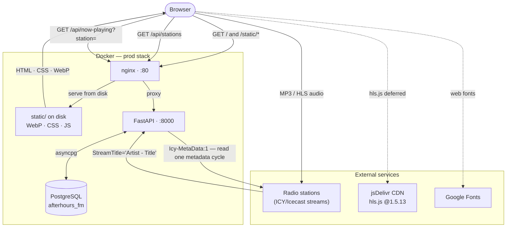

# CLAUDE.md

This file provides guidance to Claude Code (claude.ai/code) when working with code in this repository.

## Running the server

**With Docker (preferred):**

```bash
make dev    # hot-reload, SQLite, port 8000
make prod   # PostgreSQL + nginx, port 80, detached
make down   # stop all containers
```

Or directly:

```bash
docker compose up dev                        # dev
docker compose up db prod nginx --build -d   # prod
```

**Locally:**

```bash
source venv/bin/activate
uvicorn main:app --reload --port 8000
```

Config is environment-only — copy `.env.example` to `.env`. `config.py` calls
`load_dotenv()` and is imported for that side effect by `database.py` and `spotify.py`,
which is what makes a bare `uvicorn main:app` pick the file up; Docker gets it a second
way, via `env_file:` in docker-compose. Real environment variables take precedence over
the file, so compose and CI values win.
Nothing is required to play audio or identify tracks: stream info reads each station's
own ICY metadata, and Shazam recognition needs no API key. The Spotify variables are
optional and only affect the save button and cover art.

## File structure

```
afterhours-fm/
├── main.py               # FastAPI app — all API routes, ICY reader, caches, migration guard
├── stations.json         # Station registry: single source of truth AND the SSRF allowlist
├── config.py             # load_dotenv() — imported for its side effect, see below
├── database.py           # Async SQLAlchemy engine, session factory, Base
├── models.py             # ORM model: PlayedTrack + its two read indexes
├── spotify.py            # Spotify search + save-to-Liked-Songs
├── shazam_fallback.py    # Shazam-via-vibra recognition — last resort, and the *only* source for HLS
├── sunshine_playlist.py  # Sunshine Live's own published playlist — tried before Shazam
├── requirements.txt      # Production Python dependencies
├── requirements-dev.txt  # Dev/test-only dependencies (pytest etc.)
├── Dockerfile            # Multi-stage build: base → dev or prod target
├── docker-compose.yml    # dev, db (PostgreSQL), prod, and nginx services
├── Makefile              # Common tasks — see `make help`
├── package.json          # Vitest (JS test runner), npm audit
├── pytest.ini            # asyncio_mode = auto, testpaths = tests
├── .env.example          # Documents every env var, no real values
├── nginx/
│   └── nginx.conf        # Serves /static/ from disk; proxies /api/ to FastAPI
├── tests/
│   ├── conftest.py
│   ├── test_routes.py
│   ├── test_poll.py
│   ├── test_asset_version.py
│   ├── test_migration_guard.py
│   ├── test_shazam_fallback.py
│   ├── test_spotify_match.py
│   ├── test_sunshine_playlist.py
│   └── js/utils.test.js
├── .dockerignore         # Excludes venv, node_modules, .git, .env, app.db, etc.
├── streams.md            # Working notes on every station tried — what worked and why
├── .env                  # Secrets (git-ignored)
├── app.db                # SQLite database — local dev only (git-ignored)
└── static/
    ├── index.html        # Single-page HTML shell + all client-side JS (inline)
    ├── style.css         # All CSS — variables, layout, components, responsive
    ├── utils.js          # Pure helpers mirrored from index.html, covered by Vitest
    ├── hero.jpg / .webp  # Hero background (WebP 493 KB vs 811 KB JPEG)
    └── logo.png / .webp  # Nav logo (WebP 72×72, 2 KB)
```

## Architecture



**Station registry:** `stations.json` is the single source of truth for which streams
exist. The backend loads it at import into `STATIONS` / `_STATION_URLS`; the frontend
fetches it via `/api/stations` instead of carrying its own copy.

This is also a security boundary, not just a tidiness choice. `/api/now-playing` takes
a station **name** and resolves the URL server-side. An earlier version accepted
`?url=` straight from the client and opened it — a server-side request forgery (SSRF)
hole, where a caller passes `http://169.254.169.254/` (cloud instance metadata) or
`http://localhost:5432` and makes the backend fetch internal endpoints on their behalf.
The parameter was removed rather than filtered, because removing the attacker's
control over the URL entirely is what actually closes it. Two regression tests pin
this: `test_now_playing_rejects_unknown_station` and
`test_now_playing_ignores_client_supplied_url`.

**Backend:** `main.py` — single-file FastAPI app with:
- `lifespan` creates DB tables, then runs four idempotent hand-rolled migration guards in order (no Alembic in this project). Each takes an optional engine argument so tests can drive it — the lifespan itself never fires under `ASGITransport`, which is why they were untestable before. All read the dialect off the engine rather than string-matching `DATABASE_URL`, and `tests/test_migration_guard.py` runs on both CI database jobs.
  - `_ensure_station_column()` — adds `played_tracks.station` if missing, backfills old rows to `'Pure Ibiza Radio'`.
  - `_drop_rating_column()` — removes the thumbs up/down column. **Refuses to drop it if any row holds a value**: the column was verified 100% empty first, so that branch should never fire, but a migration that silently destroys data when its assumption is wrong is a bad trade for tidiness.
  - `_ensure_indexes()` — `create_all()` only emits indexes alongside a table it is *creating*, so declaring them on the model does nothing for an existing database. `CREATE INDEX IF NOT EXISTS` works on both engines, making this the one guard needing no dialect branch.
  - `_purge_ident_rows()` — deletes rows that are station/show idents rather than tracks (see below).
  - `_table_columns()` is shared by the first two: the only genuinely dialect-specific read in the codebase (`PRAGMA table_info` vs `information_schema.columns`), kept in one place.
  - No background task — everything else is on-demand, driven by requests.
- `_read_icy_now_playing(url)` — opens the stream with `Icy-MetaData: 1`, reads one audio block + its length-prefixed metadata block, parses `StreamTitle='Artist - Title'`. Pure `httpx`, no external API, no audio download/transcode. Always returns a dict, never `None` — empty `artist`/`title` just means no (new) track right now, not an error. **Must pass `follow_redirects=True`** — several stations (e.g. `stream.rcs.revma.com`) 302 to a geo-nearest edge node, and httpx doesn't follow redirects by default (unlike `curl -L`/`urllib`); this bit us once already on first deploy.
- A `StreamTitle` equal to that stream's own `icy-name` header is dropped as "the broadcaster announcing itself, not a track". All three Sunshine Live streams do this permanently (both headers are e.g. `SUNSHINE LIVE - Techno`), and unfiltered it was *worse* than sending nothing: the `" - "` split produced artist `SUNSHINE LIVE` / title `Techno`, which looked like a real track, got persisted, and — being non-empty — suppressed the fallbacks that do find the real song. Matching the station's own header rather than a hardcoded bad-title list needs no per-station upkeep; verified against every station in `stations.json`, those three are the only ones where the two are equal.
- A `StreamTitle` with **no `" - "` separator** is likewise dropped — a show or station ident, not a track. It used to be kept as artist `""` / title `<whole string>`, which is how 34 junk rows reached the database (31 of them Blue Marlin's `Djs Blue Marlin Sessions`, the single most "played" row in the table). This is a distinct case from the `icy-name` check above: Blue Marlin announces a *show* rather than repeating its own station name, so that guard never caught it. Both features added later — play counts and station similarity — are corrupted by exactly this kind of row, which is why `_purge_ident_rows()` also cleans the ones already stored: artist-less rows, plus rows whose artist is a prefix of their own station's name (the pre-guard `icy-name` split, e.g. artist `SUNSHINE LIVE` / title `Techno` on `Sunshine Live Techno`). That second rule uses `substr`/`length` rather than `LIKE` so an artist containing `%` can't act as a wildcard, with a 3-character floor against degenerate single-letter matches.
- `_parse_stream_format(headers)` — format/bitrate/sample_rate from the same response's headers, independent of whether a title is present. Three real broadcaster inconsistencies found by testing against live streams, not guessed — see the docstring: `icy-br` can be a comma-joined duplicate (`"256, 256"`, breaks bare `int()`); `icy-audio-info`'s internal params are sometimes `ice-bitrate=`/`ice-samplerate=` (laut.fm), sometimes bare `bitrate=`/`samplerate=` (Pure Ibiza); and the *header name itself* varies too — `icy-audio-info` vs `ice-audio-info` (no y). Any one of these uncaught would silently wipe the whole read via the outer try/except, not just the format fields.
- `_read_icy_now_playing_cached(url)` — same, with a 15s in-memory per-URL cache (`META_CACHE_TTL`) so rapid re-polls don't hammer a station's origin
- `ICECAST_STATUS` + `_read_icecast_listeners_cached(station)` — listener counts for the 3 stations with a confirmed Icecast mount match (Pure Ibiza Radio, Ibiza Global Classics, Ibiza Global Radio — all on `control.streaming-pro.com`, different ports). `icestats.source` is a dict when a port has one mount, a list when it has several — normalize before matching by `listenurl`. Sonica deliberately excluded: its port has 4 mounts and none match its stream filename closely enough to be sure which is actually it — better `—` than confidently wrong.
- `/api/stations` — returns the registry as-is.
- **Stale-track expiry (`CURRENT_TRACK_TTL = 180`).** `state["current"]` used to be written and never cleared, so the first track a station ever matched stayed on screen indefinitely — a Shazam-only station like Radio Panama could sit on a single stale, possibly wrong, guess for hours. `confirmed_at` is now refreshed on **every poll that yields a title**, not only on a change, and a track nothing has confirmed for the TTL is dropped (into `history`) so the UI falls back to "Now playing live". A blanket TTL is safe because a healthy ICY stream repeats its `StreamTitle` on *every* read — verified directly, three consecutive uncached reads each against Antenne Bayern and Milano Lounge, all returning the same title — so working stations re-confirm continuously and never expire. 180s is roughly four failed Shazam attempts: long enough that a DJ talkover or bad transition doesn't blank a correct answer, short enough that a wrong guess doesn't linger.
- `/api/now-playing?station=` — resolves the station name to a URL (404 if unknown), reads its live stream info (cached), returns `{current, history, stream_info}` keyed by `station` in `_station_state` (in-memory, per-station `deque(maxlen=10)`). On a track change, persists a `PlayedTrack` row via the FastAPI-injected session (not a raw `SessionLocal()` — that would bypass the test suite's DB override; see `tests/conftest.py`).
- `/api/track-history` — last 50 played tracks from the DB (any station), persists across restarts
- `/api/track-stats?artist=&title=` — play count, first/last heard and per-station breakdown for one exact track. Powers the "heard this before" badge. Served by `ix_played_tracks_artist_title`. Timestamps go out with an explicit `+00:00`: `started_at` is a naive column holding UTC, and serialised bare JavaScript's `Date()` reads it as *local* time — the same naive/aware trap that shipped a Postgres bug, pointed the other way.
- `/api/similar-stations?station=&limit=` — stations whose played artists overlap this one's, scored by **Jaccard similarity** (`|A∩B| / |A∪B|`) on the distinct artist sets. Ranking by raw shared-artist count instead would just surface whichever station has the longest history — Pure Ibiza Radio alone holds ~60% of all rows. Artists are matched case-folded (broadcasters are inconsistent), and results are filtered to stations still in `stations.json` so the picker can actually select them. The set maths runs in Python over one query of distinct `(station, artist)` pairs rather than a SQL self-join: at ~1.5k rows that's trivial and far more readable; push it into SQL past six figures.
- `/api/identify` — `POST ?station=`, the "Name this track" button. Forces a fresh Shazam recognition of the live stream and returns `{match: {artist, title, cover_url, shazam_url}}` or `{match: null}`. Three deliberate choices:
  - **Bypasses `_shazam_cache` on the way in.** The automatic path caches *negative* results for `SHAZAM_CACHE_TTL`, and the user presses this button precisely because that came back empty — replaying the cached miss would make the button look broken.
  - **Primes `_shazam_cache` on the way out**, but only on a match. The next `/api/now-playing` poll then picks the track up through the normal path and persists it, so persistence lives in one place. Caching a *miss* here would suppress the automatic fallback for the next 45s, which is the opposite of what the button is for.
  - **Per-station in-flight guard** (`_identify_in_flight`, 429 if busy). A recognition is a real ~10-15s capture; without it, repeated taps stack concurrent captures against the same stream. Released in a `finally` so a raising recognition can't leave a station permanently unidentifiable.
- `/api/spotify/save` — `POST {"artist","title"}`, calls `spotify.save_current_track()`: refresh-token grant -> search -> `PUT /me/library`. 503 not-configured, 404 no-match, 502 upstream error. **No auth of its own** — it writes to whichever account owns the configured refresh token, so the app must not be exposed publicly without authentication in front of it. The thumbs up/down feature was removed; `PlayedTrack.rating` is gone entirely (see `_drop_rating_column`).
- Track-source chain inside `now_playing()`, cheapest and most authoritative first: **ICY -> broadcaster playlist -> Shazam**. Each step only runs if the previous produced no title, so they never run alongside each other. **HLS stations skip the ICY step entirely** (`shazam_fallback.is_hls(url)`): their URL serves a text playlist rather than audio with interleaved metadata, so an ICY read would parse `.m3u8` markup as audio and come back empty every time — one wasted request per poll. They go straight to Shazam, which is their only track source.
- `_playlist_now_playing_cached(station)` -> `sunshine_playlist.fetch_for_station()` — the middle step. Only stations in `sunshine_playlist.CHANNELS` have a feed; for everything else it short-circuits without a request. One JSON GET against the API behind sunshine-live.de's own playlist page, so it's cached at `PLAYLIST_CACHE_TTL = 15` like the ICY read rather than as aggressively as Shazam, and it arrives with real cover art (no Spotify lookup needed). Tracks it returns carry `source: "playlist"`. Two traps documented in `streams.md`: the API **ignores the UTC offset it's sent** and matches naive wall-clock digits against Europe/Berlin (send UTC and you silently get tracks from two hours ago), and the main simulcast's channel returns a *show* schedule rather than tracks, so it is deliberately unmapped.
- Shazam fallback flow inside `now_playing()`: if `read["title"]` is empty, call `_shazam_fallback_cached(station, url)` -> `shazam_fallback.recognize_stream(url)` (capture ~10s of audio, fingerprint via vibra, query Shazam). Only reached when the cheaper sources genuinely gave nothing — never runs alongside a working ICY or playlist read. Two capture strategies, picked by `is_hls()`: an ICY stream's URL *is* the audio, so read bytes off the socket; an HLS URL is a playlist that must be resolved (master -> media -> segment URLs) and its `.ts` segments fetched as ordinary files and concatenated. Segments are taken from the **end** of the live window — a media playlist lists oldest-first and holds only complete segments, so the last is closest to live; starting at the front would fingerprint audio a whole window (~30s) old and, right after a track change, confidently name the previous song. A mid-capture segment failure keeps the partial clip rather than losing the attempt (m2o's CDN intermittently returns "Server disconnected without sending a response", and one segment already fingerprints reliably). `SHAZAM_CACHE_TTL = 45` (longer than ICY's 15s — a real recognition costs a ~10-15s round trip, unlike a near-instant header read) caches negative results too, so a station that just doesn't match well isn't retried every poll.
- `_spotify_lookup_cached(artist, title)` runs **once per new track, whatever the source**, and returns `{cover_url, spotify_url}` from `spotify.search_track()` (read-only, no save). A settled answer — a hit, a verified no-match, or missing credentials — is cached indefinitely per `artist|title` (neither a cover nor a Spotify URL changes), with a 1000-entry cap so it can't grow forever. A **transient** failure (429, timeout, upstream 5xx) returns `None` *without* caching: this cache has no TTL, so storing one blanked that track's cover permanently, and flipping quickly through stations bursts enough searches to trip Spotify's rate limit — exactly when a run of tracks would otherwise lose their art for good.
  - Cover art: Shazam- and playlist-sourced tracks already carry their own `cover_url`, which **wins**; the lookup's cover never overrides it. ICY-sourced tracks have none, so they use the lookup's.
  - `spotify_url` is persisted on the row. That column existed from the first schema and nothing ever wrote to it, so every row logged before this had it NULL *while this exact lookup was being made and its URL discarded*. This is why the lookup now runs even when a cover already exists — it costs one extra cached search per new track and makes stored history clickable.
  - **Matching is verified, not top-hit.** ICY metadata is not a search query: it arrives ALL CAPS, uses `x` / `FEAT.` / `&` as artist separators, and carries version suffixes the release may not use (`(Extended Mix)`, `(Radio Edit)`). Spotify's free-text search never returns "no match" for a loose query — it ranks *something* — so the old `limit: 1` + `items[0]` returned confidently wrong art: measured against real station output, **6 of 8 matched results were a different song entirely** (`SUGARDADDY - Don't Look Any Further` -> Nelly's `Batter Up`), and one was a karaoke backing version. The wrong cover was the visible half; the wrong `spotify_url` was *persisted on the row*, which outlives it. `spotify._search()` now asks for 5 candidates, tries the field-filtered form (`artist:"…" track:"…"`) first and free text as a fallback, and puts every candidate through `_is_match()`, which requires agreement on **both** artist and title — title alone matched a different song of the same name (`Show Me Love`), artist alone is too weak because broadcasters credit remixers inconsistently. Names are compared as whole **token runs**, not raw substrings, so `Adriatique` still matches `Adriatique x GENESI` while `&ME` (normalized `me`) no longer matches `Megamen`. Karaoke/tribute artists are rejected outright. Measured over 30 recent logged tracks: 28 matched correctly, 2 rejected — both genuinely absent from Spotify. `tests/test_spotify_match.py` pins the real cases.
- `/static/*` serves everything in `static/`; `/` returns `static/index.html`

**Database:** `database.py` + `models.py` — async SQLAlchemy.
- `PlayedTrack` stores: title, artist, album, station, started_at, spotify_url, apple_music_url, deezer_url
- Two indexes, both serving reads that were full table scans: `ix_played_tracks_started_at` (track history is `ORDER BY started_at DESC LIMIT 50` — without it, a sort of the whole table to return 50 rows) and `ix_played_tracks_artist_title` (the per-track play count). `started_at` is indexed **ascending on purpose**: a btree walks in either direction, so both engines satisfy a `DESC` order from it with a backward scan; a DESC index only earns its keep for a mixed-direction multi-column sort, which nothing here does.
- **Prod:** PostgreSQL 16 (`postgresql+asyncpg://`), injected via `DATABASE_URL` in docker-compose
- **Local/dev:** SQLite (`sqlite+aiosqlite:///./app.db`), the default when `DATABASE_URL` is not set
- `started_at` is a **naive** `TIMESTAMP` column (no tz stored) — always strip tzinfo before inserting (`datetime.now(timezone.utc).replace(tzinfo=None)`). asyncpg rejects a tz-aware value outright ("can't subtract offset-naive and offset-aware datetimes"); SQLite silently accepts it, which is exactly how this shipped broken against Postgres the first time and wasn't caught until a real deploy.

**Reverse proxy (prod only):** `nginx/nginx.conf`
- gzip enabled for CSS, JS, and JSON responses
- Images (`*.webp`, `*.jpg`, `*.png`): 30-day cache + `immutable` — browsers skip network entirely on repeat visits
- CSS/JS: 1-day cache without `immutable`. `index.html` is *not* under `/static/` (it's served from `location /`), so it carries only an ETag and revalidates on every load — which is what makes the cache-buster below work.
- **`style.css` is loaded as `?v=<first 8 hex of its sha256>`.** Without it a CSS change is invisible for up to a day to anyone who has already loaded the page — exactly how a corrected logo background kept rendering stale. Because `index.html` revalidates, a changed `?v=` reaches the browser immediately while unchanged visits keep the cache. `tests/test_asset_version.py` fails if the two drift, so editing `style.css` without bumping the version is caught by the suite rather than silently not shipping.
- `/api/` proxied to `prod:8000`
- `/` falls back to `index.html`

**Frontend:** `static/index.html` — all JS is inline. (`static/utils.js` holds pure
helper functions mirrored from that inline script; it exists so `tests/js/utils.test.js`
can exercise them in isolation. Editing `utils.js` does not change the running page.)
- `STATIONS` starts empty and is filled by `loadStations()` from `/api/stations` at boot; `buildStationButtons()` renders the picker once it arrives. A fetch failure shows a `.stations-error` message rather than an empty picker that looks like a CSS bug.
- `isHls(station)` (`url.includes(".m3u8")`) now only picks the **pre-first-poll** placeholder — "Identifying track…" for HLS (a Shazam capture takes ~10-15s, so "Reading stream info…" would misdescribe the wait) vs "Reading stream info…" for everything else. Once a poll has actually returned with no track, the placeholder is **"Now playing live" for any station**: "reading stream info" is a lie once it's been read and there was nothing, which is a real state for any station now that the server expires unconfirmed tracks. It no longer gates whether `/api/now-playing` is called: HLS stations are polled like any other, they just have no broadcaster metadata so the server fingerprints their audio instead. Playback routing (hls.js vs plain `<audio>`) is a separate inline `url.includes(".m3u8")` check in `startPlay()`
- Hero background uses CSS `image-set()` (WebP first, JPEG fallback); `<link rel="preload">` in `<head>` tells the browser to fetch it before CSS is parsed
- Nav logo uses `<picture>` with a WebP `<source>` and PNG fallback
- `fetchNowPlaying()` polls `/api/now-playing?station=` every 20s for whichever station is active, updates the hero + info panel, and updates `statFormat`/`statBitrate`/`statSampleRate`/`listenerStat`/`navListeners` from `data.stream_info` — for *any* station. Static per-station `format`/`bitrate`/`sampleRate` in `stations.json` are just the initial fallback (shown at selection time, before the first poll lands) — mainly relevant for HLS stations, which never get live `stream_info` back (the route returns `format`/`bitrate`/`sample_rate` as `None` for them — there are no ICY headers to read).
- "Name this track" button (`shazamBtn`) — `data-state`: `idle` -> `listening` -> `done` (click opens the track's Shazam page) or `error` (auto-resets after 4s). It **used to be a plain link to shazam.com's homepage**: the user landed there, clicked Shazam's mic button, and Shazam listened through the *device microphone* — so it identified whatever the room could hear. That needed speakers rather than headphones, needed mic permission, was wrong if anyone was talking, and fed nothing back into the app. The server already fingerprints stream audio directly, so the button calls `/api/identify` instead: one click, no new tab, no microphone, and it hears the actual stream. Once resolved the button becomes a deep link to *that track* on Shazam (`shazam_url`, from Shazam's own `track.share.href`) — where the original link was trying to get to. Resets on both station and track change. The label is `overflow: hidden` + ellipsis because a resolved track name is far longer than the idle label.
- "Add to Spotify" button (`spotifySaveBtn`): `data-state` attribute drives its look — `idle` (disabled until a real title exists) -> `saving` -> `done` (click re-opens `data-spotifyUrl`) or `error` (auto-resets after 4s). Resets on both station change (`resetSpotifySave()`) and track change (new `artist|title` key in `fetchNowPlaying()`), so a stale "Added ✓" doesn't linger onto the next song.
- `#heroTrackInfo` wraps `#heroCover` (album art, hidden if `c.cover_url` is falsy) + `#heroArtist`/`#heroTitle`/`#heroSource`/`#heroHeard`. `heroSource` shows "via Shazam" only when `c.source === "shazam"` — a Shazam-fallback guess from a ~10s audio sample is worth flagging as such, vs. the broadcaster's own ICY announcement. The cover is stacked **above** a centred artist/title block (it used to be a 52px thumbnail beside left-aligned text) and sized `clamp(140px, 26vw, 200px)` via `--cover-size` on `.hero-track` — one custom property drives both the artwork and the height reserved for it, so the ≤720px override (120px) needs no second calculation. `.hero-track` reserves `--cover-size + 110px` up front: the player bar and station picker are inside the same centred `.hero-content` column, so without the reservation the whole thing shifts ~200px the moment the first cover lands (measured 0px shift with it). `#heroCover` carries an inline `onerror` that hides the `` — a rotted cover CDN was invisible at 52px and is a large broken-image box at 200px.
- `#heroTitle` is an `<a>` to the song on **Genius**, not a `<p>`. Genius has no keyless "page for this song" endpoint, so it links to Genius's own search with the query pre-filled. Everything about the query was measured against that search rather than guessed:
  - **Version suffixes are stripped** (`Closer (Extended Mix)` -> `Closer`, and anything after `" - "`). Genius indexes *songs*, not releases — the remix name is the token that makes the search miss. Same reasoning as `spotify.py`'s `_core_title`, one layer up.
  - **Only the primary artist is used.** The full ICY credit (`JOEL CORRY x DAVID GUETTA x BRYSON TILLER`) returned *no song at all* for 3 of 5 real tracks tried; the primary alone got 4 of 5 exactly right. Split on `x` / `vs` / `feat.` / `ft.` / `featuring` / `with` / comma.
  - **`&` and `and` are deliberately not separators**, unlike in `spotify.py`. They sit inside band names constantly (Hercules & Love Affair, Simon & Garfunkel) and Genius resolves a genuine `&` collab anyway (CamelPhat & ARTBAT -> correct). Where truncation does bite a real name it costs nothing — `Earth September` and `Man Raise Your Flag` both still return the right song, because the title carries the search.
  - `setHeroTitle()` **removes the `href` attribute** when there is no title rather than setting it to `""`: an `<a>` with no href renders as plain text, takes no pointer, no hover and no focus ring, so the "Now playing live" placeholder can't be a dead link — which is also why the CSS hover rule is qualified `.hero-track-title[href]:hover`. `heroTitle.textContent` still returns the bare title, which is what the Spotify save button reads back off the DOM. `geniusSearchUrl()` is mirrored into `static/utils.js` and covered by Vitest.
- `#heroHeard` — the "heard this before" badge, e.g. *"11th play · first heard 22 Aug on Pure Ibiza Radio"*. Filled by `fetchTrackStats()` from `/api/track-stats`, called **on track change only**, not on every 20s poll. Hidden when `plays < 2`: the row for the current play is already persisted by the time it's queried, so `plays === 1` means "first time" and there's nothing worth saying. `ordinal()` is mirrored into `static/utils.js` and covered by Vitest — the 11/12/13 exception is why it isn't a plain last-digit lookup.
- `#stationsSimilar` — a "Stations like this" block from `/api/similar-stations`, refreshed on station change. 25 stations in a flat list give no clue which are alike; these suggestions improve as listening history accumulates. It **used to be a row of small pills under the station picker**, in the hero — there is no vertical room left there now the cover art is full size, so it moved into the info section below the two-column grid. That move is what pays for the format: each suggestion is a card that states *why* it is a suggestion ("16 shared artists · Biscits, Blackwood, …") instead of hiding it in a tooltip, and the limit went 3 -> 4. Moving from the dark hero onto the white info background means the whole palette flips, which is why `.similar-*` is charcoal-on-off-white rather than the old translucent-white-on-dark. Built with `createElement` + `textContent`/`.title` rather than `innerHTML` **on purpose**: artist names reach the browser from broadcaster ICY metadata, which is third-party input the app doesn't control and must not inject as markup.
  - **Suggestions come only from `stations.json`, never from an online directory.** radio-browser.info was measured as a source of off-registry suggestions and rejected for now on two grounds. Quality: only **12 of the 25 stations resolve by name** there (all five Ibiza 1 channels, all three Antenne sub-channels, Radio Panama, Ondalatina, m2o Dance, Deep Vibes and Dub Ninja are absent), and 3 of those 12 carry no tags — so a lookup-driven feature would return nothing for 16 stations. Security: everything except playback (the ICY read, Shazam capture, listener counts) needs the **backend** to fetch the station URL, and `stations.json` is the SSRF allowlist that makes that safe. Taking a stream URL from a crowd-sourced directory anyone can write to would reinstate the hole `/api/now-playing` was rewritten to close. If this is revisited: supply a `genre` tag per station in `stations.json` rather than looking our stations up, search radio-browser by that tag, and treat results as **discovery only** — a name and a link, with adding one to the registry a reviewed commit, never a runtime write.

## Key environment variables

| Variable | Purpose |
|---|---|
| `POSTGRES_PASSWORD` | PostgreSQL password. Required for prod stack (`db` and `prod` services both read it). |
| `DATABASE_URL` | SQLAlchemy async DB URL. Not set locally — defaults to `sqlite+aiosqlite:///./app.db`. Injected by docker-compose for prod: `postgresql+asyncpg://afterhours_fm:<password>@db:5432/afterhours_fm`. |
| `SPOTIFY_CLIENT_ID` / `SPOTIFY_CLIENT_SECRET` / `SPOTIFY_REFRESH_TOKEN` | Spotify app credentials for `/api/spotify/save` and cover-art search. Register an app at developer.spotify.com and obtain a refresh token once via the authorization-code flow with the `user-library-modify` scope. Without these, `spotify.save_current_track()`/`search_track()` raise `SpotifyNotConfigured` and the features degrade quietly. |

No env var needed for Shazam recognition — vibra queries Shazam's endpoint directly, no API key involved (it's an unofficial/reverse-engineered client, same category as the shazamio Python library that was tried and rejected first — its endpoint returned no matches in testing; vibra's did).

## Testing

```bash
make test            # pytest + Vitest
make test-backend    # ./venv/bin/pytest
make test-frontend   # npm test (Vitest, runs from project root)
make security        # npm audit — exits 1 if vulnerabilities found
```

Backend tests use `pytest-asyncio` (auto mode) and `pytest-mock`. Frontend tests use Vitest v4.

Because the route now resolves station names against the real registry, route tests
register their fake stations through the `_register_test_stations` fixture in
`tests/test_routes.py` — `monkeypatch` restores the real `_STATION_URLS` afterwards.

## Stream notes

- **Pure Ibiza Radio:** `http://control.streaming-pro.com:8028/stream.mp3` — Icecast 2.4, 256 kbps MP3, 48 kHz stereo. `icy-metaint` is present but `StreamTitle` is always empty — this is exactly the station the Shazam fallback exists for, not a bug in `_read_icy_now_playing`.
- **Icecast status endpoints:** wired up server-side, not per-station in the frontend — see `ICECAST_STATUS` in `main.py` (3 stations, all on `control.streaming-pro.com` at different ports).
- **Sunshine Live:** all three streams send their own name as the `StreamTitle` forever. Techno and House get real tracks from `sunshine_playlist.py`; the main simulcast has no per-track source at all (its playlist channel carries shows, not songs) and falls through to Shazam.
- **`streams.md`** has the full working log of every station tried: which have real per-track `StreamTitle`, which send static/fake data (station name, or a broadcaster-specific JSON blob instead of a title — e.g. Pure Ibiza's own `StreamTitle='NOW ON AIR {"autor":...}'`, filtered out via the `"{" in raw` check in `_read_icy_now_playing`), and which are HLS-only with no ICY concept at all (BBC Radio 4 FM, m2o, m2o Dance, Dub Ninja) — those now get tracks from Shazam via HLS segment capture rather than showing nothing.
- **Ibiza Pura** (`ibizapura.streaming-pro.com:8000/ibizapura`, listed in `streams.md`'s "Old Stations") is another ICY-empty station but was **never added** to `stations.json` — worth adding if it comes up again, since the Shazam fallback now makes it just as usable as Pure Ibiza Radio.

## Station logos

`stations.json` entries carry an optional `logo` field — a **hotlinked** URL (never downloaded/stored in the repo) shown in the hero title in place of styled text. Sourced from [radio-browser.info](https://www.radio-browser.info/)'s crowd-sourced `favicon` field, which is how most FOSS radio-player apps solve this — some resolve to a station's own official domain (Blue Marlin, Ibiza Global Classics, Antenne Bayern), others to a third-party aggregator's hosted copy (same risk tier as any radio-aggregator app). Copyright reasoning: nominative use (identifying the station, not implying endorsement) in a personal, non-commercial app is low-risk; hotlinking rather than storing a copy keeps it that way. Don't add a `logo` by downloading/re-hosting an image found via a Google Images search or similar — ask first, same as any other file download.

**Re-audited: all 17 logos in `stations.json` now resolve** (confirmed via real HTTP requests checking status *and* `content-type`, since a favicon that 301s to a homepage still returns 200 with `text/html`). Where a logo is absent it's because no correct one could be verified, not because it's broken — `onerror` on the `` in `selectStation()` catches this and swaps in the plain styled-text span, so nothing breaks, they just silently don't show a logo:
**Fixed in the re-audit** (all had rotted since first indexed):
- Pure Ibiza Radio — the `radio.es`-hosted image 404d; now the station's own brand logo (`logo-pure-300x189.png`, 18 KB). Its `favicon.ico` also resolves but is a 110 KB `.ico`; the sized PNG is the better asset.
- Sunshine Live (all 3 sub-brands share one logo) — the Wikimedia Commons thumbnail 400d; now the broadcaster's own `upload.sunshine-live.de` icon, which tracks their rebrands instead of a third-party copy
- Sonica — `ibizasonica.com` now 403s every icon path (Cloudflare). No verified replacement exists, so the dead URL was **removed** rather than left in: a broken logo costs a failed request on every station selection and buys nothing.

**8 stations deliberately carry no logo** — Sonica, the five Ibiza 1 channels, Antenne Chillout, Deep Vibes. Nothing correct could be verified for them: Ibiza 1's and Deep Vibes' sites serve no icon, and Antenne Chillout's page carries only *other* channels' `streamlogo` assets plus a 2000px page banner. A wrong logo is worse than none, so they fall back to the styled-text span.

Two traps worth repeating if re-checking later:
- **Check `content-type`, not just the status code.** A favicon that 301s to a homepage returns `200 text/html`, which a status-only check reads as healthy.
- **Reject signed URLs.** radio-browser returned CloudFront links for Sonica carrying `Expires=…&Signature=…`; they resolve today and break within days.

Re-run the radio-browser.info search per station name and re-verify each result with a real HTTP request before trusting it — the database is crowd-sourced and drifts. Check the returned station *name* too: a search for "sonica" offered a Dutch "LOMP Sonica" logo, which is a different station entirely.

**`logoBackground`:** an optional per-station field, currently `"dark"` on Pure Ibiza Radio only. The hero renders every logo on a light card by default, which exists to rescue near-black marks (Ibiza Global Classics' SVG is `fill #231f20`) from vanishing into the dark hero — but it fails the opposite case: Pure Ibiza's logo is lime-on-transparent and washes out on white. Flipping the default would just swap which set of logos is illegible, so the exception is data-driven per station rather than a global change or a CSS rule keyed on station name. Setting it requires the logo to actually have an alpha channel — Pure Ibiza's is RGBA (verified by reading the PNG header, not assumed); a logo with a baked-in white background would be unaffected.

**Adding a new station:** append an entry to `stations.json`. Both the backend allowlist and the frontend picker read from it, so there's nothing else to update. Set `format`/`bitrate` if known; otherwise the stats panel shows `—` until the first live poll. Check `streams.md` first in case the station's already been tried and found to send fake/static metadata.

## Style guide

The palette lives in `:root` at the top of `static/style.css` — that file is the only
source for it. (A `Style_Guide.txt` describing an unrelated "Radio Calico" brand used to
sit in the repo; its mint/forest-green palette never matched this app's CSS and it was
removed rather than published as if it applied here.)

| CSS variable | Hex | Role |
|---|---|---|
| `--azure` | `#0B7BB5` | Section headings, stream link borders |
| `--turquoise` | `#2BBFB0` | Active states, live indicator, links |
| `--sand` | `#E8D5A3` | Track artist label in hero |
| `--deep` | `#0A2840` | Nav, footer, player bar backgrounds |
| `--charcoal` | `#1C1C1E` | Body text |
